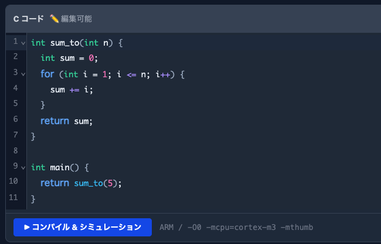
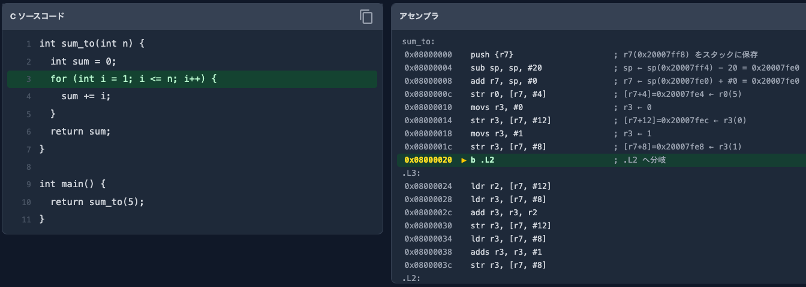
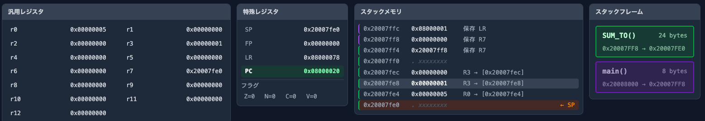
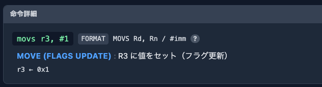
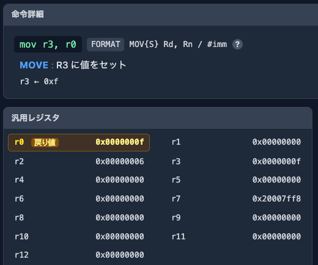
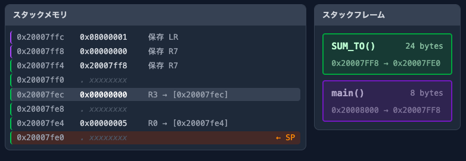

## アセンブラ、正直に言う。わかったふりをしていた。

大学の授業でアセンブラが出てきた瞬間、わかったふりをして先に進んでいた記憶がある。

```
square(int):
  push  {r7, lr}
  sub   sp, sp, #8
  add   r7, sp, #0
  str   r0, [r7, #4]
  ldr   r3, [r7, #4]
  mul   r3, r3, r3
  mov   r0, r3
  adds  r7, r7, #8
  mov   sp, r7
  pop   {r7, pc}
```

「これ……C のどこに対応してるの？」

レジスタって何？SP って何？なぜ `sub sp, sp, #8` するの？
教科書を読んでも、頭に入ってこない。命令の意味は調べればわかる。でも、**全体の流れ**がつかめない。

そういう人は、きっと私だけじゃないはずだ。

---

## AI全盛時代に、今さらアセンブラ？

「ChatGPT があるんだから、低レイヤーの勉強なんて意味あるの？」

その気持ちもわかる。でも、こう考えてほしい。

AI はコードを書いてくれる。しかし、**なぜそのコードが動くのか**を説明してくれるのは、あなた自身の理解だ。

- なぜポインタがクラッシュするのか
- なぜスタックオーバーフローが起きるのか
- なぜ最適化でコードの挙動が変わるのか

これらの答えは、すべて低レイヤーの知識の中にある。アセンブラを理解した瞬間、C言語がガラス張りになる。バグの原因が「見える」ようになる。**この感覚は、一生物だ。**

AI がコードを書く時代は、すでに始まっている。「Vibe Coding」という言葉が生まれ、自然言語だけでアプリが完成する。

でも、それでもいいじゃないか。

CPU がどう動くかを知ること、アセンブラの一行一行の意味を追うこと——それ自体が、純粋に楽しい。「役に立つから学ぶ」だけが勉強じゃない。**仕組みを知る喜び**は、どんな時代になっても誰にも奪えない。

---

## こういうツールがあれば、もっと早く理解できた

学生時代の自分に送りつけたいツールを作った。

**AsmWalker** — C言語とアセンブラの対応を、1命令ずつ確認しながら学べるブラウザ学習ツールだ。

👉 https://asm-walker.vercel.app

特別なインストールは不要。ブラウザだけで動く。

---

## 何ができるのか

### C コードをその場でコンパイルして、アセンブラをステップ実行

エディタに C コードを書いて「コンパイル」を押すだけ。


Godbolt Compiler Explorer の API 経由で、本物の GCC（ARM / x86-64）がコンパイルする。
生成されたアセンブラを、1命令ずつ実行できる。

### C の行とアセンブラの行が、同時にハイライトされる

「この `str r0, [r7, #4]` は C の何行目に対応してるの？」

その答えが、一目でわかる。


### レジスタとスタックの変化をリアルタイムで確認できる

命令を進めるたびに、レジスタの値が変わる。スタックにデータが積まれる。


`sub sp, sp, #8` の意味がわからなかった人も、これを見れば一発で理解できる。

### 命令の日本語説明が出る

知らない命令が出てきても、画面を離れなくていい。意味・フォーマット・実行結果がその場で確認できる。


### ARM / x86-64 の両方に対応

- ARM Cortex-M（GCC 11.2.1 / 13.2.0 / 14.3.0）
- x86-64（GCC 14.2.0、Intel 構文）

組み込み系でも、PC/サーバー系でも使える。

---

## 実際に使ってみる

### 関数呼び出しを追う

サンプルに「関数呼び出し」が用意されている。

```c
int add(int a, int b) {
  return a + b;
}

int main(void) {
  int x = add(3, 5);
  return x;
}
```

これをコンパイルして、ステップ実行してみよう。

- `bl add` 命令で関数が呼ばれる瞬間
- `push {r7, lr}` でスタックに LR（戻り先アドレス）が積まれる様子
- `pop {r7, pc}` で LR が PC に戻され、呼び出し元に返る瞬間



ABI（呼び出し規約）の動きが、目の前で展開される。

### スタックフレームを可視化する

関数が呼ばれるたびにフレームが積み上がり、`return` で戻るたびに消えていく。「スタックフレームとは何か」が、図を見た瞬間に腑に落ちる。


---

## 技術構成

| レイヤー | 技術 |
|---|---|
| フロントエンド | Vue 3 + TypeScript + Tailwind CSS |
| エディタ | CodeMirror 6 |
| コンパイル | Godbolt Compiler Explorer API |
| ホスティング | Vercel |

Godbolt API は CORS を許可しているため、バックエンド不要。ブラウザから直接コンパイルリクエストを送っている。

パーサー・インタープリタ・トレーサーはすべてフロントエンドで動く TypeScript 実装。ARM / x86 を完全分離した設計にしている。

---

## アセンブラを「読める」感覚を、ぜひ体験してほしい

最初の一歩は、難しくない。

サンプルから好きなコードを選んで、`▶` ボタンを押すだけでいい。
慣れてきたら、自分で書いた C コードをそのままコンパイルして試せる。「この書き方だとアセンブラはどうなる？」という疑問を、その場で検証できる。

命令が1つ進むたびに、レジスタが変わる。スタックが動く。C の行がハイライトされる。

その瞬間に、「あ、こういうことか」という理解が来る。

あのとき画面を閉じた自分に、今すぐ教えてやりたい。

👉 **https://asm-walker.vercel.app**

ソースコードも公開しています。
👉 https://github.com/kubotak0310/asm-walker

---

## 学習ガイドも用意しています

ツール内のガイドメニューから読めます：

- マシン語とアセンブラ、そして PC
- アセンブラの読み方
- スタックの仕組み
- 関数呼び出しの仕組み
- 条件分岐とフラグレジスタ
- ポインタとアセンブラ

アセンブラをゼロから学びたい人の入口として使ってください。
